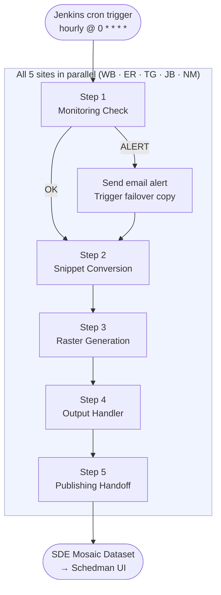
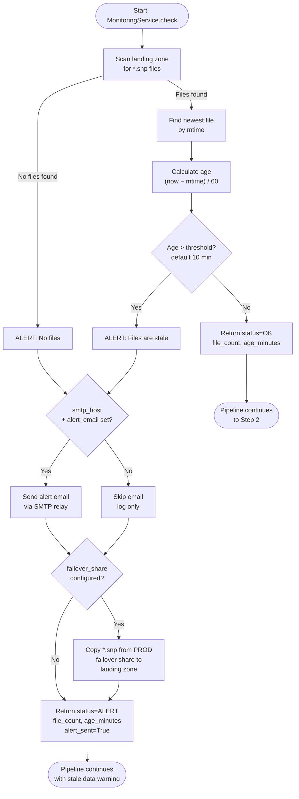
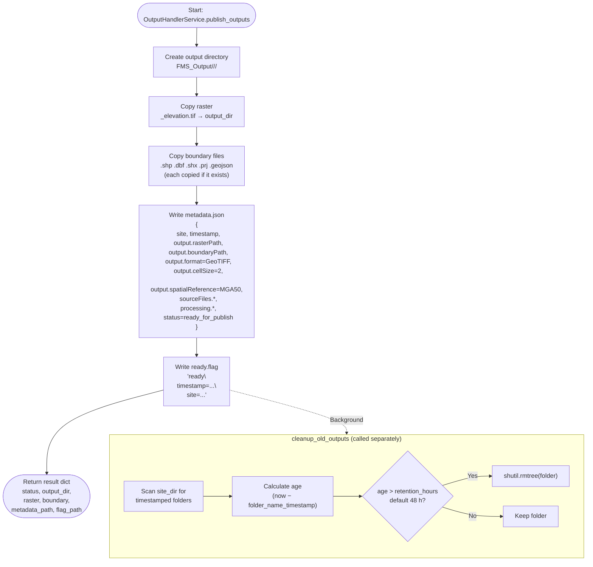
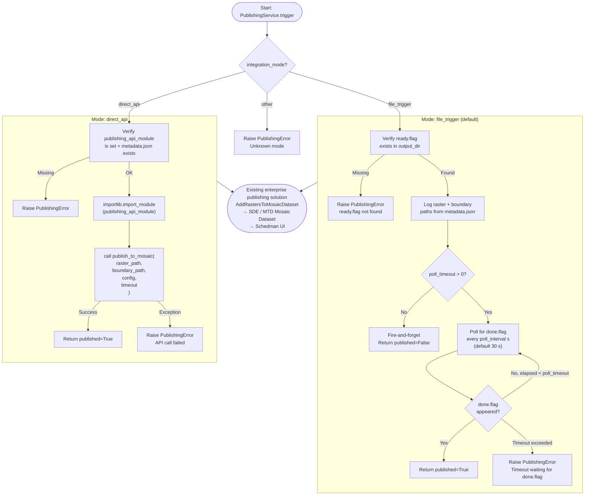
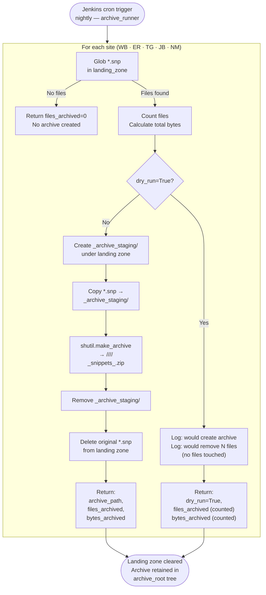

# FMS Live Surface — Pipeline Flow Diagrams

Each diagram covers exactly what happens inside that stage, including inputs, decisions, outputs, and error paths.

---

## Overall Pipeline



---

## Step 1 — Monitoring Check (`monitoring_service.py`)

Checks that GIP has delivered fresh `.snp` files before processing starts.



**Key data:**
| Input | Output |
|-------|--------|
| `landing_zone/*.snp` | `{status, site, file_count, newest_file_age_minutes, alert_sent}` |

---

## Step 2 — Snippet Conversion (`snippet_conversion_service.py`)

Converts binary Minestar `.snp` files to a filtered, reprojected MGA50 CSV.

```mermaid
flowchart TD
    START([Start: SnippetConversionService.convert]) --> GLOB

    GLOB["Glob *.snp files\nin input_folder"]

    GLOB --> LOOP

    subgraph LOOP["For each .snp file"]
        VAL["Validate: magic number\n0xBFFF0173 at byte 0\n+ marker byte 0x0B at 31/36"]
        VAL -->|Invalid| SKIP[Skip file\nlog warning]
        VAL -->|Valid| SCAN2["Scan bytes from offset 20\nlooking for marker 0x0B"]
        SCAN2 --> RECORD["For each marker found:\nread 40-byte record\n10×uint32 (little-endian)"]
        RECORD --> PARSE["Parse: X=item[0]×0.01\nY=item[1]×0.01\nZ1-Z4, T1-T4 pairs\nscale by 0.01"]
        PARSE --> DEDUP["Dedup by XY key:\nif same XY exists\naverage Z values\nkeep newer timestamp"]
    end

    LOOP --> ZADJ["Z datum adjustment\nZ += z_adjustment\n(default +3.155 m\nADPH → AHD)"]

    ZADJ --> ZFILT["Noise filter:\nRemove points where\nZ > max_z (default 4000 m)"]

    ZFILT --> DESPIKE{despike=True?}

    DESPIKE -->|Yes| D3["3× despike passes"]

    subgraph D3["Despike: 3 passes"]
        NBRS["For each point:\nfind up to 8 neighbours\nat ±grid_size distance"]
        NBRS --> NCOUNT{< min_neighbours\nneighbours found?\ndefault 3}
        NCOUNT -->|Yes| FLAG[Flag for removal]
        NCOUNT -->|No| ZCHECK["Compute neighbour\nmedian + std-dev"]
        ZCHECK --> ZDEV{|median − Z|\n> std-dev?}
        ZDEV -->|Yes| REPLACE[Replace Z\nwith median]
        ZDEV -->|No| KEEP[Keep Z]
        FLAG --> REMOVE[Remove flagged\npoints after pass]
    end

    DESPIKE -->|No| REPROJECT
    D3 --> REPROJECT

    REPROJECT["Reproject via arcpy:\ninput_spatial_ref → MGA50\n(WB94/ER94 → GDA2020)"]
    REPROJECT --> AOIFILT{aoi_feature_class\nconfigured?}

    AOIFILT -->|Yes| AOI["AOI filter:\nRemove points outside\nboundary polygon"]
    AOIFILT -->|No| WRITE

    AOI --> WRITE

    WRITE["Write outputs to\n<output_folder>/<site>/<YYYYMMDD_HHMM>/"]
    WRITE --> CSV["<site>_points.csv\nColumns: X, Y, Z, TIMESTAMP"]
    WRITE --> JSON["config.json\n{site, timestamp, csvPath,\nsnippetCount, totalPoints,\nvalidPoints, processing params}"]

    CSV --> DONE([Return result dict\nstatus, csv_path,\nconfig_path, valid_points])
    JSON --> DONE
```

**Key data:**
| Input | Output |
|-------|--------|
| `*.snp` (Minestar binary, WB94/ER94 coords) | `<site>_points.csv` (MGA50, X/Y/Z/TIMESTAMP) |
| | `config.json` (processing metadata) |

---

## Step 3 — Raster Generation (`raster_generation_service.py`)

Converts the MGA50 point CSV into an elevation GeoTIFF raster and boundary polygon.

```mermaid
flowchart TD
    START([Start: RasterGenerationService.generate]) --> ARCPY

    ARCPY["Check out ArcGIS\n3D Analyst + Spatial Analyst\nextensions"]

    ARCPY --> GDB{scratch GDB\nexists?}
    GDB -->|No| CREATEGDB["Create File GDB\nin scratch_gdb path"]
    GDB -->|Yes| S1
    CREATEGDB --> S1

    S1["Step 1: CSV → 3D Feature Class\narcpy.management.XYTableToPoint\n  x_field=X, y_field=Y, z_field=Z\n  coordinate_system=MGA50"]

    S1 --> S1C["GetCount → log\npoint_count"]

    S1C --> S2["Step 2: 3D Feature Class → TIN\narcpy.ddd.CreateTin\n  in_features: Shape.Z masspoints\n  spatial_reference: MGA50"]

    S2 --> S3["Step 3: TIN → Raw GeoTIFF\narcpy.ddd.TinRaster\n  data_type=FLOAT\n  method=LINEAR\n  cell_size=2.0 m (default)"]

    S3 --> S4["Step 4: Boundary polygon\narcpy.management.MinimumBoundingGeometry\n  geometry_type=CONVEX_HULL\n  group_option=ALL"]

    S4 --> EXCL{exclusion_fc\nconfigured &\nexists?}

    EXCL -->|Yes| ERASE["Erase road buffer\narcpy.analysis.Erase\n  erase_features=MTD_Live_RoadsBuffered\n  → boundary without roads"]
    EXCL -->|No| CLIP

    ERASE --> CLIP

    CLIP["Step 5: Clip raster to boundary\narcpy.management.Clip\n  clipping_geometry=ClippingGeometry\n  → <site>_elevation.tif"]

    CLIP --> EXPORT["Step 6: Export boundary\narcpy.conversion.FeaturesToJSON\n  → <site>_boundary.geojson\narcpy.management.CopyFeatures\n  → <site>_boundary.shp"]

    EXPORT --> CLEANUP["Delete raw raster\n(intermediate file)"]

    CLEANUP --> GDBCLEAN{GDB was created\nthis run?}
    GDBCLEAN -->|Yes| DELGDB["arcpy.management.Delete\nscratch GDB\n(best-effort)"]
    GDBCLEAN -->|No| CHECKIN
    DELGDB --> CHECKIN

    CHECKIN["Check in extensions\n3D Analyst + Spatial Analyst"]

    CHECKIN --> DONE([Return result dict\nstatus, raster_path,\nboundary_path, point_count])
```



**Key data:**
| Input | Output |
|-------|--------|
| `<site>_points.csv` (MGA50) | `<site>_elevation.tif` (GeoTIFF, 2 m cells) |
| | `<site>_boundary.shp` + `.geojson` (convex hull − road buffer) |

---

## Step 4 — Output Handler (`output_handler_service.py`)

Assembles the standardised output folder that the publishing solution reads.



**Output folder layout:**
```
FMS_Output/
└── WB/
    └── 20260414_1400/
        ├── WB_elevation.tif
        ├── WB_boundary.shp
        ├── WB_boundary.dbf
        ├── WB_boundary.shx
        ├── WB_boundary.prj
        ├── WB_boundary.geojson
        ├── metadata.json
        └── ready.flag          ← triggers publishing solution
```

---

## Step 5 — Publishing Handoff (`publishing_service.py`)

Notifies the enterprise publishing solution that outputs are ready.



---

## Nightly Archive Job (`archive_service.py` + `archive_runner.py`)

Runs once per night. Compresses the day's `.snp` files and clears the landing zone.



**Archive folder layout:**
```
archive_root/
└── WB/
    └── 2026/
        └── 04/
            └── WB_snippets_20260414_020000.zip
```
